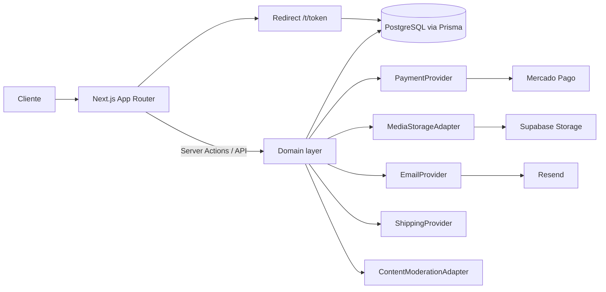

# Arquitetura

Decisões técnicas e diagramas. Complementa `PROMPT_MESTRE_PLATAFORMA_PRESENTE_NFC.md`.

## Decisões principais

| Decisão | Escolha | Justificativa |
|---|---|---|
| Framework | Next.js 16 (App Router) + React 19 | Exigido pela spec; Server Components reduzem JS no site público. |
| Estilo | Tailwind CSS v4 | Exigido; tokens de marca centralizados em `globals.css`. |
| ORM | **Prisma** | Migrations robustas, suporte nativo a enums/relações, ótima DX e tipagem. Drizzle foi considerado, mas Prisma é mais maduro para o modelo rico em enums desta aplicação. |
| Validação | Zod | Schema compartilhado cliente/servidor, versionado para o conteúdo do projeto. |
| Banco | PostgreSQL (Supabase em prod; container local em dev) | Exigido. RLS aplicado apenas em produção (Supabase). |
| Pagamento | Mercado Pago (via `PaymentProvider`) | Exigido; contrato preparado para Stripe futuro. |
| Storage | Supabase Storage (via `MediaStorageAdapter`) | Exigido; adapter permite migrar para R2 depois. |
| E-mail | Resend (via `EmailProvider`) | Exigido; dev registra prévia em log. |
| Testes | Vitest (unitários); Playwright (E2E, Fase 5) | Exigido. |

## Diagrama de componentes

## Camadas

1. **`src/lib/domain`** — regras puras (preços, slug, tokens, estado, música, sanitização). Sem I/O;
   testável isoladamente.
2. **`src/lib/adapters`** — interfaces de integração + implementações (prod/dev/fake). A lógica de
   negócio depende apenas das interfaces.
3. **`src/lib/auth`** — autorização por papéis (pura) e magic link de desenvolvimento.
4. **`src/app`** — rotas e componentes. Rotas privadas são protegidas no servidor.

## Princípios

- **Baixo acoplamento:** adapters são trocáveis; o domínio não importa Prisma/Next/fetch.
- **Segurança no servidor:** preço, publicação, webhook e autorização nunca dependem do frontend.
- **Ambientes honestos:** provedor fake de pagamento só existe em desenvolvimento e é bloqueado em
  produção. Integrações reais (Mercado Pago, Resend, Supabase) exigem credenciais e nunca são
  "simuladas" como concluídas.

## Tema e marca

Cores, fontes e dados jurídicos ficam em `src/lib/brand.ts` e `src/app/globals.css` (seção 7 da
spec). A marca atual é "Memória Eterna" (domínio `memoriaeternaprime.com.br`).
